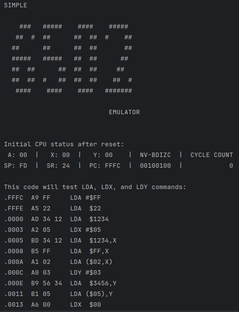
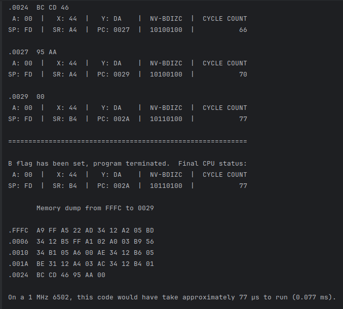
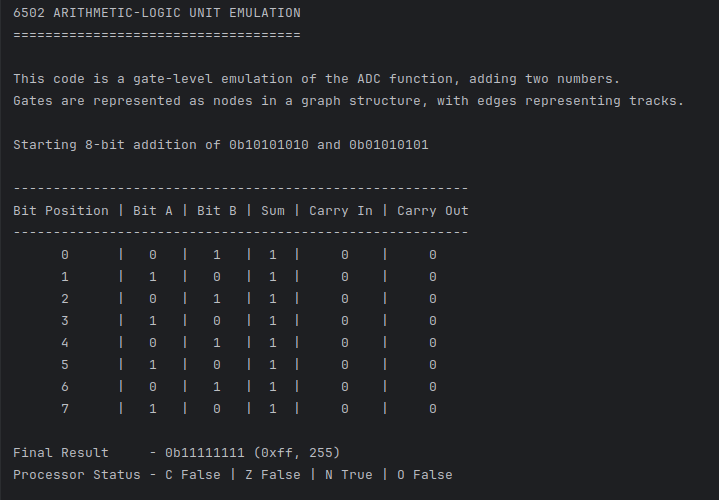

# 6502 Emulator (C and Python)

## A (VERY) Sketchy Emulator for the MOS 6502

------

This is an emulator for the MOS 6502 8-bit microprocessor. There are version in both C and Python. It recreates the behavior of the CPU at instruction level, with optional cycle count accuracy in the Py version and partially at gate level (with preparations to go to transistor level). This was an exercise in both understanding the CPU to get a deeper look at assembly coding, at bitwise operations in C and Py, and at emulator design. When I felt I had an impression of that, I instantly abandoned the project. :) -- Written as part of the DFG-funded project *Cultures of Home Computer Music* at the University of Music and Theatre Leipzig, Germany.

------

## What It Can Do

### CPU Implementation

- CPU registers and flags implemented: `A`, `X`, `Y`, `SP`, `PC`, `SR`
- Opcode decoding and execution, including addressing modes, for a small subset of opcodes (check the code for detailed list)
- Flag updates
- Immediate, zeropage, absolute, indirect and indexed modes

### Cycle Counts (only in Python)

- Implements instruction cycle counts (from 6502 manuals)
- Page crossing penalties included
- Tracks total clock cycles to simulate a 1 MHz 6502

### Memory Model (only in Python)

- `settings.py` provides a structured memory layout (RAM, ROM, I/O areas) -- which is of utter inconsequence for the emulator...
- 64 KB total memory

### Gate-Level ALU Simulation for ADC

- `alu.py` contains a logic gate-based simulation of an 8-bit ALU.
- Simulates only one command, namely `ADC` (Add with Carry).
- Bonus: includes BCD mode with decimal correction ready to be implemented into the emulator.
- A "Transistor" class has been prepared, but is not yet used for gate construction.

### Little Stuff

- There's some hard-wired code in 6502 assembly or opcodes in the code, and it has some tracing / debugging / CPU status / memory dump functionalities

---

## What It Fundamentally Doesn't Do

- In short, everything else.
- No stack operations.
- No interrupts.
- No decimal mode logic in core emulator, although I built it later for the transistor-level emulation.
- No opcode disassembly.
- 90 % of opcodes are not implemented.
- It would be easy to have some memory layout consequences by forbidding `STA`, `STX`, and `STY` to memory regions marked as ROM.

---

## Contents

+ `6502.c` is the original C code
+ `6502.py` is the marginally less bad Python code
+ `cc6502.py` contains the info for the cycle counts
+ `settings.py` contains some parameters, flag constants, and the memory layout that is not implemented

---

## What It Looks Like (Really Unspectacular)

---

---

I really learned an awful lot writing this. However, I frankly do not plan to continue expanding it any more right now.

christoph.hust@hmt-leipzig.de