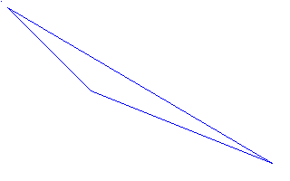
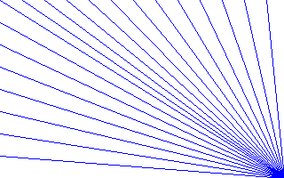
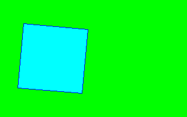

# Commodore 16 Graphics API

## A Recreation of Some Commodore BASIC V3.5 Commands in C

---

This code re-imagines (more than recreates) parts of Commodore BASIC V3.5's graphics commands in C. It emulates the 320 x 200 "hi-res" mode of the TED chip and provides drawing functions for lines, boxes, and fill operations, loosely following the syntax of the original commands. This was an exercise in recreating BASIC commands as part of the DFG-funded research project _Cultures of Home Computer Music_ at the University of Music and Theatre, Leipzig, Germany, but applied to visuals instead of sound.

---

## Features

- C16-style commands: `GRAPHIC`, `SCNCLR`, `DRAW`, `BOX`, `PAINT`, `LOCATE`
- Pixel-based rendering using RGB colors
- Supports drawing via linked lists
- Utility functions for line drawing (Bresenham), rotation, etc.

The program consists of a series of graphics demos and saves their results to HDD. There is no direct graphical output included in the code: everything is saved directly to files `output1.bmp` ff.

**Line Drawing** uses Bresenham's algorithm, translated from: Klaus Löffelmann and Axel Plenge: *Das Grafikbuch zum Commodore 16*, Düsseldorf, 1986

**Flood Fill** uses an iterative stack-based implementation

**Rotations** use trigonometric transformations (cos/sin) around pivot points

**Bitmap Saving** uses a minimal BMP file writer outputting 24-bit BMPs.

---

## Possible Extensions

I thought about extending this, but that would have to grow into an extensive BASIC interpreter by:

1. Parsing input lines
2. Generating a syntax tree
3. Managing variables and state via hash tables
4. Executing commands via a simple interpreter loop

I tested parsing and variable storage in a calculator app, but then did not continue because I am lazy. References for this would have to be Bob Nystrom's *Crafting Interpreters* alongside other titles from Terence Parr (*Language Implementation Patterns*) or Daniel P. Friedman and Mitchell Wand (*Essentials of Programming Languages*).

---

## Output

Demo 1

Demo 2

Demo 3

Demo 4

---

christoph.hust@hmt-leipzig.de